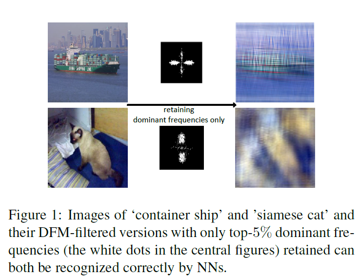

## Official website of 'What do neural networks learn in image classification? A frequency shortcut perspective (Paper accepted at ICCV2023)'
#### The paper is available on [arXiv](https://arxiv.org/abs/2307.09829).

### Introduction

Frequency analysis is useful for understanding the mechanisms of representation learning in neural networks (NNs). Most research in this area focuses on the learning dynamics of NNs for regression tasks, while little for classification. This study empirically investigates the latter and expands the understanding of frequency shortcuts. First, we perform experiments on synthetic datasets, designed to have a bias in different frequency bands. Our results demonstrate that NNs tend to find simple solutions for classification, and what they learn first during training depends on the most distinctive frequency characteristics, which can be either low- or high-frequencies. Second, we confirm this phenomenon on natural images. We
propose a metric to measure class-wise frequency characteristics and a method to identify frequency shortcuts. The results show that frequency shortcuts can be texturebased
or shape-based, depending on what best simplifies the objective. Third, we validate the transferability of frequency shortcuts on out-of-distribution (OOD) test
sets. Our results suggest that frequency shortcuts can be transferred across datasets and cannot be fully avoided by larger model capacity and data augmentation. We recommend
that future research should focus on effective training schemes mitigating frequency shortcut learning.

<p align="center"></p>


### Quick start

* Clone this repository:
```
git clone https://github.com/nis-research/nn-frequency-shortcuts.git
cd nn-frequency-shortcuts
```

* Installation
	* Python 3.9.12, cuda-11.7, cuda-11.x_cudnn-8.6
		* You can create a virtual environment with conda and activate the environment before the next step
			```
			conda create -n virtualenv  python=3.9 anaconda
			source activate virtualenv
			conda install pytorch torchvision torchaudio pytorch-cuda=11.7 -c pytorch -c nvidia
			```
	* Install other packages
		```
		pip install -r requirements.txt
		```
* Datasets can be [dowloaded](https://drive.google.com/drive/folders/1Ug4WDwQWlFJpdks1woSsY6gWuSMYzNSB?usp=sharing) here
* Computing ADCS
```
python -u Evaluation/compute_ADCS.py
```

* Computing DFM, e.g.
		
```
python -u Evaluation/test_rank.py  --backbone_model resnet18 --model_path /checkpoints/last.ckpt     --patch_size 1 
```

* Visualizing DFMs, e.g. 
```
python -u Evaluation/visualize_DFM.py --DFMs resnet18_DFM_1
```
* Testing on DFM-filtered datasets, e.g.
```
python -u Evaluation/verify_mask_imgn.py  --backbone_model resnet18  --m_path  ./DFMs/resnet18_DFM_1   --model_path /checkpoints/last.ckpt  

```


* Training models, e.g. 
	```
	python -u train.py   --backbone_model resnet18 --lr 0.01 --dataset imagenet10   --save_dir results/  --image_size 224  --num_class 10    
	```
	* Options for `--dataset`: synthetic, imagenet10
	* Options for `--image_size`: 32, 224
	* Options for `--num_class`: 4, 10
	* There are four synthetic datasets, choosing dataset by adding arguement `--special _complex_special_1_par` for `Syn_1`, `--special _complex_special_2_par` for `Syn_2`, etc.

## Citation

```
@InProceedings{wang2023neural,
    title={What do neural networks learn in image classification? A frequency shortcut perspective}, 
      author={Shunxin Wang and Raymond Veldhuis and Christoph Brune and Nicola Strisciuglio},
    booktitle = {International Conference on Computer Vision (ICCV)},
    year      = {2023},
}
```

